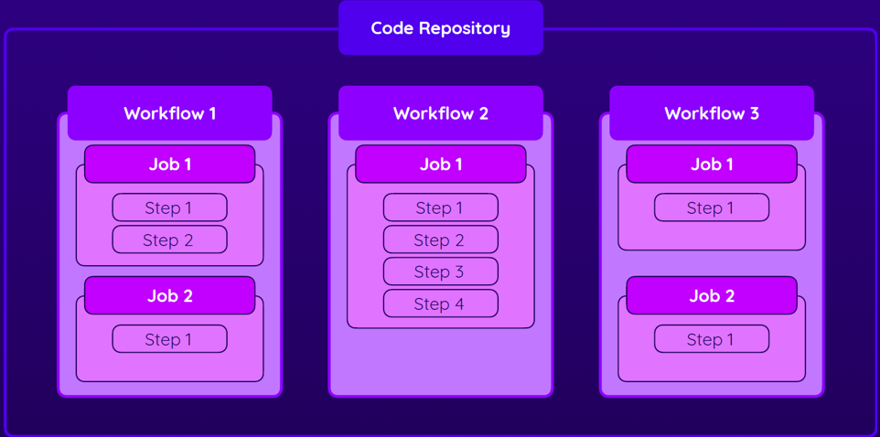

# DEMO CICD

## Les principes de base

Pour déployer les applications, on utilise les GitHub actions.

Les GitHub actions sont des workflows qui permettent d'effectuer des actions en automatique sur un repository.

Tous les workflows doivent être définis dans le répertoire .github/workflows

Chaque workflow est représenté par un fichier *.yml. 
Chaque workflow est constitué de JOB qui sont eux même constitués de STEP

Les workflows vont être déclanchés par des actions pré-définies.
Par défaut, tous les job d'un workflow vont être lancés en parallèle. 
Et dans un job, tous les steps vont être lancés sussessivement.
Dans un même workflow, il sera possible d'attendre la fin d'un job pour en déclencher un autre. 
Mais cela devra être précisé dans la déclaration.

